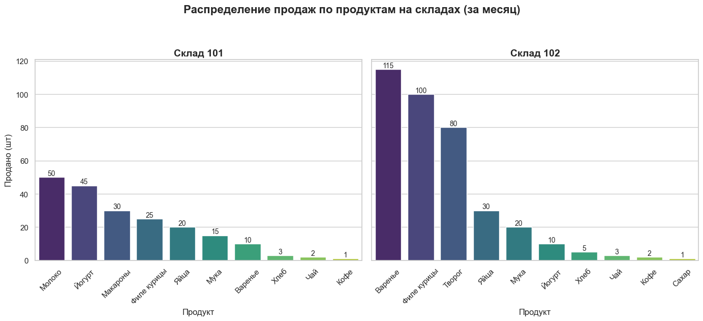
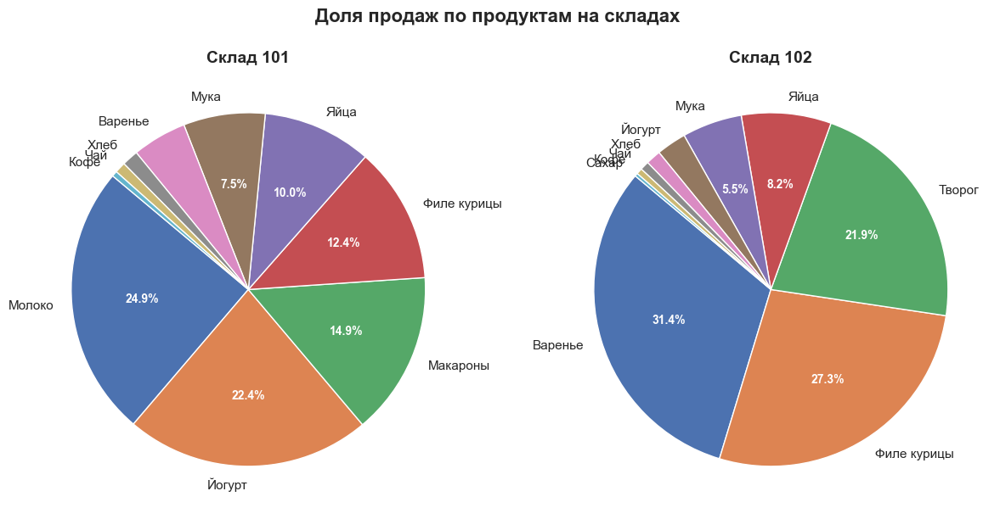
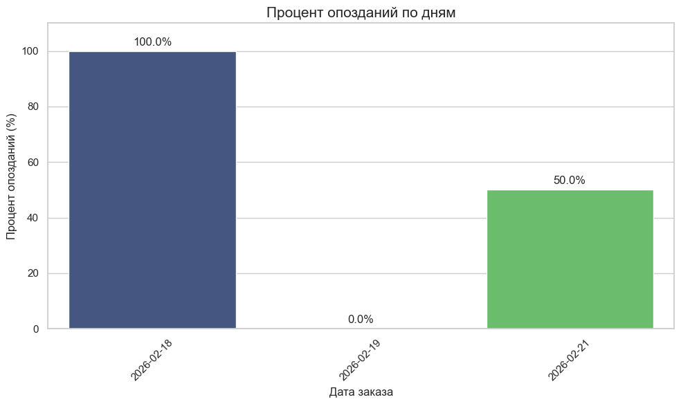

# 🛒 Анализ логистики и продуктовой метрики (интервью на позицию продуктового аналитика в "Самокат")

## 📋 О проекте
Решение тестового кейса для позиции Product Analyst. 
Задача включала анализ продаж по складам, мониторинг времени доставки и оценку влияния нового бизнес-ограничения заказы.

**Стек:** Python (Pandas, Matplotlib, Seaborn), SQL (SQLite).

---

## 🎯 Решенные задачи

### 1. ABC-анализ ассортимента по складам
**Задача:** Выделить 5 лучших и худших по продажам для каждого склада за последний месяц.  
**Бизнес-ценность:** Оптимизация складских запасов, планирование закупок и выявление неликвидных товаров.

**Техническое решение:**
- Использованы **CTE** для соедининения и фильтрации таблиц.
- Применены **оконные функции** `ROW_NUMBER()` с разбиением `PARTITION BY` для ранжирования товаров внутри каждого склада (при этом одновременно по убыванию продаж и по возрастанию).
- Визуализация продаж по товарам для каждого склада


> *Фрагмент логики:*
> ```sql
> ROW_NUMBER() OVER (PARTITION BY warehouse_id ORDER BY total_sold DESC) as rn_desc
> ```

### 2. Мониторинг соблюдения доставки
**Задача:** Рассчитать долю заказов с доставкой дольше 15 минут с разбивкой по дням.  
**Бизнес-ценность:** Контроль качества сервиса, выявление дней с операционными сбоями.

**Техническое решение:**
- Использование конструкции `SUM(CASE WHEN ...)` для подсчета нарушений.
- Визуализация динамики процента опозданий с аннотацией значений на столбцах, а также на круговой диаграмме.



### 3. Оценка продуктового гипотезы
**Ограничение:** Введение лимита на количество SKU бутылок воды в заказе для снижения веса заказа.

**Продуктовый анализ:**
1.  **Ключевые метрики успеха:**
    *   📉 *Средний вес заказа*. Данная метрика должна снизиться.
    *   💰 *AOV (Average Order Value)* — контроль, чтобы ограничение не снизило выручку.
    *   🔄 *Retention Rate* — отслеживание оттока недовольных пользователей.
    *   📦 *Доля заказов с водой* и *среднее кол-во SKU воды в заказе*.

2.  **Обход ограничений (gaming the system):**
    *   Пользователи могут дробить один большой заказ на несколько последовательных мелких.
    *   Замена крупных объемов на множество мелких упаковок других брендов.

3.  **Как обнаружить по данным:**
    *   Для выявления дробления заказов необходимо группировать заказы по `user_id` и суммировать количество SKU воды в каждом из заказов и суммарно.
